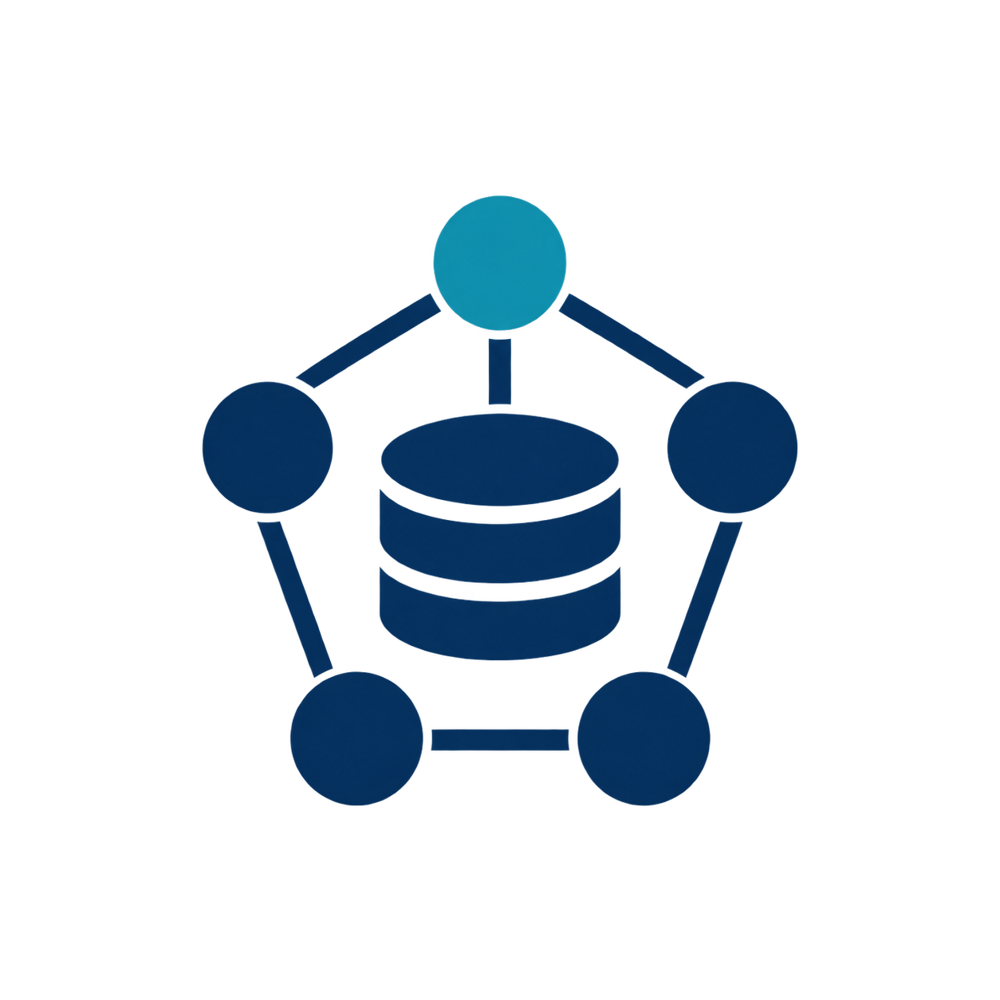

<div align="center">



# raftkv


> A distributed key-value store built from scratch in Go, implementing the Raft consensus algorithm for leader election, log replication, and crash recovery — with chaos tests for network partitions and node failures.

</div>

---

## Overview

`raftkv` is not a wrapper around an existing consensus library. It's a from-scratch implementation of Raft, built to survive the failure modes that actually break naive distributed systems: crashed nodes, network partitions, and split-brain scenarios.

Every guarantee below is backed by an automated test that kills real OS processes, partitions real TCP connections, and asserts on the result — not a happy-path demo.

---

<div align="center">

## Tech Stack


</div>

---

## Architecture

The system is split into two independent layers:

- **`raft/`** — the consensus engine. Knows nothing about keys or values; it only replicates an opaque log of commands across nodes and guarantees they're applied in the same order everywhere.
- **`kv/`** — the state machine. Applies committed log entries to an in-memory map. Could be swapped for a queue, a lock service, or anything else without touching consensus code.

This separation mirrors how production systems like etcd and CockroachDB are structured.

```
raftkv/
├── cmd/raftkv/      entrypoint — starts a node from config
├── raft/            leader election, log replication, WAL, RPC transport
├── kv/              the key-value store and its state machine
├── client/          client SDK — leader discovery, retries
├── test/            cluster integration tests and chaos tests
└── config/          cluster topology
```

---

<div align="center">

## Verified Guarantees

| Guarantee | Proven by |
|---|---|
| No data loss on crash | `TestRestartAfterCrash` — kills and restarts a node, confirms prior writes survive |
| Correct failover on leader death | `TestKillLeaderMidOperation` — kills the leader mid-operation, confirms a new one is elected and writes continue |
| No split-brain | `TestMinorityCannotServeWrites` — a true minority partition is proven unable to accept writes |
| Partition tolerance | `TestNetworkPartitionIsolatesMinority` — an isolated node is cut off, majority keeps serving, isolated node rejoins cleanly on heal |

</div>

---

## Known Limitations

Built and left open deliberately, not overlooked — a correct system should know exactly where its own edges are:

- **Followers apply log entries on append, not on confirmed commit.** Real Raft applies only once an entry is majority-replicated; this implementation applies slightly earlier, which is safe in the tested scenarios but not fully spec-correct under all interleavings.
- **A partitioned-but-still-alive leader can still answer local reads.** There's no leader lease or read-index protocol yet, so a stale leader cut off from the majority could theoretically serve outdated data to a client still pointed at it.
- **Every RPC opens a fresh TCP connection** rather than reusing a persistent one per peer. This works, but adds latency that required widening the election timeout window to stay stable — a connection-pooled version would allow faster failover.

None of these break the guarantees above under the tested failure modes — they're the gap between "provably correct in the scenarios covered" and "correct under every possible interleaving," which is the honest, normal state for a project at this stage.

---

## Getting Started

```bash
git clone https://github.com/yourusername/raftkv.git
cd raftkv
go build -o raftkv.exe ./cmd/raftkv
```

Run a 3-node cluster locally (one command per terminal):

```powershell
.\raftkv.exe 1
.\raftkv.exe 2
.\raftkv.exe 3
```

Run the full chaos test suite:

```powershell
cd test
go test -v -timeout 60s
```

Requires Go 1.22 or later.

---

## Why Raft

Distributed consensus is one of the few problems in systems engineering where "looks like it works" and "is actually correct" diverge sharply. Getting a Raft implementation to pass chaos tests surfaced three distinct real bugs during development — a mutex deadlock, an election-timeout-vs-network-latency margin issue, and a subtle `gob` zero-value serialization bug — each invisible in code review and only caught by actually killing processes and partitioning connections. That gap between "reads correctly" and "behaves correctly under failure" is the entire reason this project exists.

---

<div align="center">

## License

MIT

</div>